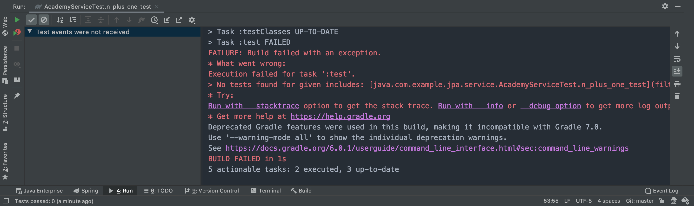

# BUG FIXED
> 개발하면서 버그를 고친 사례들을 모아놓은 곳입니다.
> 버그를 공유하고 다음에 같은 버그가 발생하였을 때 빠르게 찾아볼 수 있기 위함입니다.

## 2020-02-05
### IntelliJ + Spring Boot 패키지 이름
패키지 이름이 `java.xxx`로 시작하면 프로젝트가 동작하지 않는다.. 찾아보니 java로 시작하는 패키지는 금지되어 있다고 한다. 에러 모습은 아래와 같다.

- 테스트 에러

    

- 프로덕션 에러

    

- Reference
    - <https://stackoverflow.com/questions/5490555/prohibited-package-name-java>
    - <https://androidhuman.tistory.com/46>

