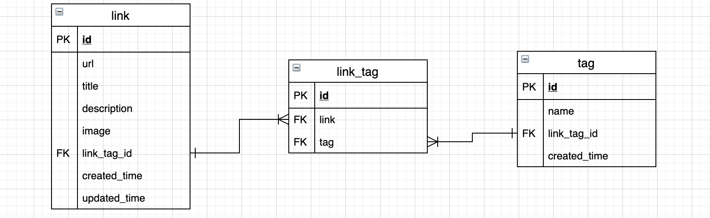

# Entity 관계 설정

## Link-Tag Entity 관계
Link1은 Tag1, Tag2, Tag3을 가질 수 있다. 그리고 Tag1 역시 Link1, Link2, Link3을 가질 수 있다. 따라서 Link와 Tag의 관계는 ManyToMany이다. (게시글과 댓글 관계를 봤을 때 게시글 1은 댓글 1,2,3을 가질 수는 있지만 댓글 1이 게시글 2와 관계를 가질 수는 없다. 따라서 게시글과 댓글 관계는 ManyToOne)

하지만 JPA에서 ManyToMany 관계는 여러 문제가 있고, 어차피 내부에서 양쪽 키만 관리하는 테이블을 만든다. 그렇게 하면 내가 관리할 수 없는 테이블이 생기게 되는 문제점이 있다고 생각했다. 그래서 해결방법으로는 일반적으로 중간의 키 테이블을 직접 만들어서 ManyToOne, OneToMany 양방향으로 만드는 것이다.

### Reference
- [[JPA] @ManyToMany, 다대다[N:M] 관계](https://ict-nroo.tistory.com/127)