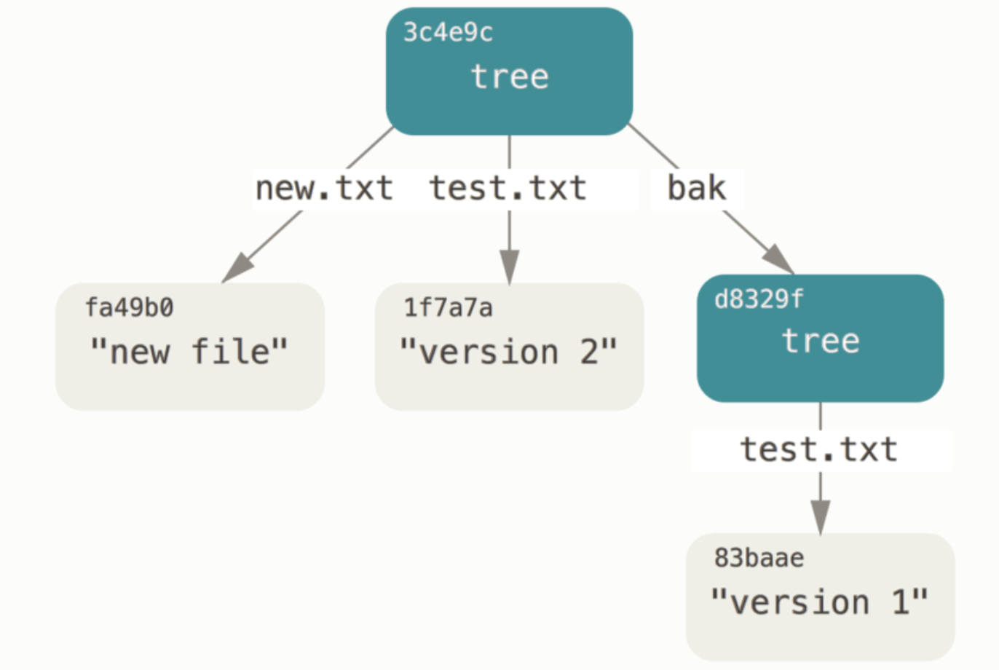
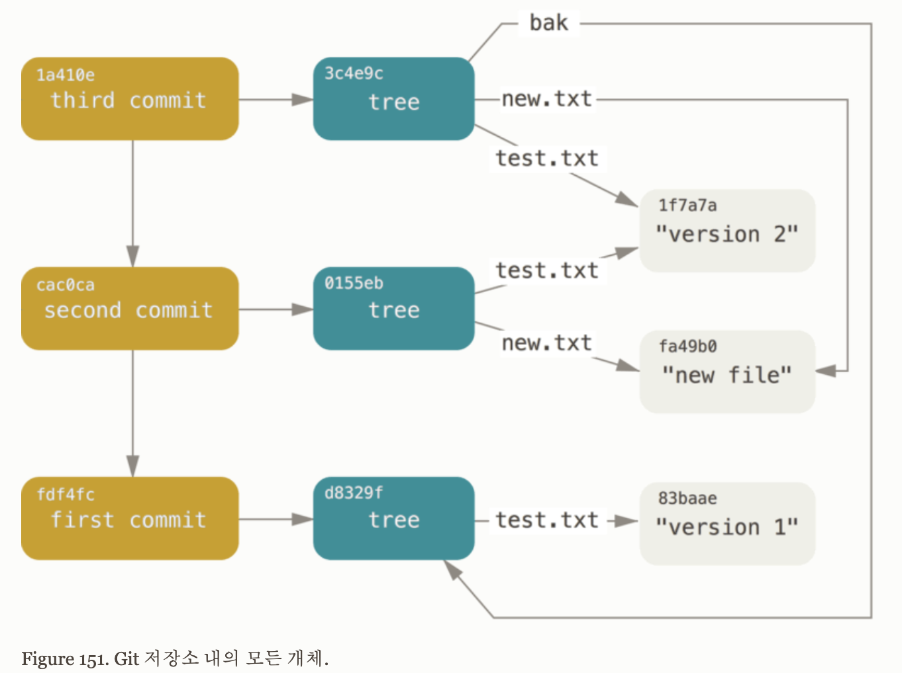

# 10. Git 내부
Git은 기본적으로 Content-addressable 파일 시스템이고 그 위에 VCS 사용자 인터페이스가 있는 구조이다.

## 10.1 Plumbing 명령과 Porcelain 명령
Git은 기본적으로 저수준 명령어로 구성되어 있어, 이 명령어를 엮어서 실행하거나 스크립트로 만들어서 사용하도록 설계되었다. 하지만 이전까지 살펴본 `chekcout`, `branch`, `remote` 등은 저수준 명령어보다는 좀 더 사용자에게 친숙하게 만들어논 명령어이다.

여기서 저수준 명령어는 **Plumbing 명령어**라고 하며, 좀 더 사용자에게 친숙한 사용자용 명령어는 **Porcelain 명령어**라고 한다.

기존의 디렉토리를 Git으로 관리하고 싶을 때는 `git init` 명령어를 사용한다. 이 명령어를 사용하면 해당 디렉토리에 `.git` 파일이 만들어지며 다음과 같은 디렉토리 구조를 갖는다.

```
$ git init
```

```
.git
├── HEAD
├── config
├── description
├── hooks
│   ├── applypatch-msg.sample
│   ├── commit-msg.sample
│   ├── fsmonitor-watchman.sample
│   ├── post-update.sample
│   ├── pre-applypatch.sample
│   ├── pre-commit.sample
│   ├── pre-merge-commit.sample
│   ├── pre-push.sample
│   ├── pre-rebase.sample
│   ├── pre-receive.sample
│   ├── prepare-commit-msg.sample
│   └── update.sample
├── info
│   └── exclude
├── objects
│   ├── info
│   └── pack
└── refs
    ├── heads
    └── tags
```

- `description`: GitWeb 프로그램에서만 사용하므로 신경쓰지 않아도 된다.
- `config`: 해당 프로젝트에만 적용되는 설정 옵션이 저장되어 있다.
- `info`: `.gitignore` 파일과 같은 무시할 파일의 패턴을 적어두는 곳이다.
- `hooks`: 클라이언트 훅이나 서버 훅이 위차한다.
- **HEAD**: 현재 Checkout 한 브랜치를 가리킨다.
- **index**: Staging Area의 정보를 저장한다.
- **objects**: 모든 컨텐츠를 저장하는 데이터베이스이다.
- **refs**: 커밋 개체의 포인터(브랜치, 태그, 리모트 등)을 저장한다.


## 10.2 Git Objects
Git은 Content-addressable 파일시스템이라고 했는데, 이는 **Key-Value** 데이터 저장소라는 것이다. 예를 들면 파일 이름-파일 데이터와 같은 데이터를 저장하는 것이다. 어떤 형식의 데이터라도 집어넣을 수 있고 해당 Key로 언제든지 데이터를 다시 가져올 수 있다.

여기서 데이터 저장소 역할을 하는 곳이 `.git/objects` 디렉토리이다. 이 디렉토리에 저장하는 방법 중 하나는 Plumbing 명령어인 `git hash-object`를 사용하는 것이다.

위에서 `git init`으로 초기화한 후 아무런 저장 파일이 없어 `objects` 디렉토리가 비어있는 것을 보았다. 그러면 먼저 표준 입력을 데이터로 해서 Key-Value 형태로 저장해보자.

```
$ echo 'test content' | git hash-object -w --stdin
```

- `-w`: 실제로 저장하는 옵션이다. (이 옵션이 없으면 저장하지 않고 단순히 Key 값만 보여준다.)
- `--stdin`: 표준 입력으로 입력되는 데이터를 읽는다.

위 명령어 결과로 다음과 같은 해시값을 보여준다.

```
d670460b4b4aece5915caf5c68d12f560a9fe3e4
```

그리고 objects 디렉토리에도 다음과 같이 디렉토리와 파일이 생성된 것을 볼 수 있다.

```
.git/objects
├── d6
│   └── 70460b4b4aece5915caf5c68d12f560a9fe3e4
├── info
└── pack
```

`git hash-object` 명령이 출력하는 것은 **40자 길이의 체크섬 해시**이다. 이 해시는 헤더 정보와 데이터 모두에 대한 SHA-1 해시이다. 실제 objects 디렉토리에 저장되는 방식은 결과 해시의 앞의 2 글자를 따서 디렉토리 이름으로 하고, 나머지 38 글자로 파일 이름을 만드는 것이다.

objects에 저장된 Value 값을 불러올려면 `git cat-file` 명령을 사용한다.

```
$ git cat-file -p d670460b4b4aece5915caf5c68d12f560a9fe3e4
```

- `-p`: 파일 내용 출력

```
test content
```

그러면 이제 하나의 파일을 만든 후 Git 저장소에 저장하고 그 파일의 내용을 변경하면 어떻게 되는지 살펴보자.

```
$ echo 'version 1' > test.txt
$ git hash-object -w test.txt

83baae61804e65cc73a7201a7252750c76066a30
```

만들어진 test.txt 내용을 다음과 같이 저장하고 다시 저장해보자.

```
$ echo 'version 2' > test.txt
$ git hash-object -w test.txt

1f7a7a472abf3dd9643fd615f6da379c4acb3e3a
```

objects 디렉토리 구조를 보자.

```
.git/objects
├── 1f
│   └── 7a7a472abf3dd9643fd615f6da379c4acb3e3a
├── 83
│   └── baae61804e65cc73a7201a7252750c76066a30
├── d6
│   └── 70460b4b4aece5915caf5c68d12f560a9fe3e4
├── info
└── pack
```

Git 저장소는 모든 변경사항을 위처럼 저장하고 있기 때문에 test.txt 파일을 지우더라도 version 1, version 2 모두 되돌릴 수 있다.

현재 'version 2'를 저장하고 있는 test.txt 파일을 Git을 사용하여 'version 1'로 되돌려보자.

```
$ git cat-file -p 83baae61804e65cc73a7201a7252750c76066a30 > test.txt
$ cat test.txt

version 1
```

이처럼 파일의 SHA-1 키를 사용하는 것은 매우 번거로운 일이다. 또한 원래 파일의 이름은 저장하지도 않았고 단지 파일 내용만을 저장했다. 이러한 개체를 **Blob 개체**라고 한다. 이는 `git cat-file -t` 명령으로 확인할 수 있다.

```
$ git cat-file -t 83baae61804e65cc73a7201a7252750c76066a30

blob
```

### Tree 개체
Tree 개체는 파일 이름을 저장한다. 그리고 파일 여러 개를 한꺼번에 저장할 수도 있다. Git 파일시스템은 모든 것을 Tree와 Blob 개체로 저장한다. Tree는 유닉스의 디렉토리에 대응되고 Blob은 Inode나 일반 파일에 대응된다.

Tree 개체 하나는 항목을 여러 개 가질 수 있다. 그 항목에는 Blob 개체나 하위 Tree 개체를 가리키는 SHA-1 포인터, 파일 모드, 개체 타입, 파일 이름이 저장되어 있다.

IntelliJ에서 일반적으로 생성되는 Spring Boot 프로젝트에서 Tree 개체를 살펴보자.

```
$ git cat-file -p 'master^{tree}'

100644 blob 007f31904eed3190ac02b38fbbe4c8c79e753c74	.gitignore
100644 blob cec94771c2f6d0994a0f826dd2588dda203222f5	README.md
100644 blob 54fc643c306f3fe25a93c81157ba254bd3eed56d	build.gradle
040000 tree 1653b4a2a67212a4932275f599a6640ab811a53c	gradle
100755 blob fbd7c515832dab7b01092e80db76e5e03fe32d29	gradlew
100644 blob 5093609d512a96947851d39fa2dc05df2af2248e	gradlew.bat
100644 blob 0c4a4592ea06a7d36e99a7d618897753c304b38b	settings.gradle
040000 tree 11fdff7c02f9f5646f4c87696c94cf60ca475b48	src
```

- `master^{tree}`: master 브랜치가 가리키는 Tree 개체를 말한다.

그러면 직접 Tree 개체를 만들어보자. Git은 일반적으로 **Staging Area(Index)**의 상태대로 Tree 개체를 만들고 기록한다. 따라서 Staging Area에 파일을 추가해서 Index를 만들어야 한다. 우선 Plumbing 명령인 `update-index` 명령으로 test.txt 파일만 들어 있는 Index를 만든다. 이 명령어는 인위적으로 Staging Area에 추가하는 명령이다.

```
$ git update-index --add --cacheinfo 100644 83baae61804e65cc73a7201a7252750c76066a30 test.txt
```

- `--add`: 아직 Staging Area에 없는 파일이기 때문에 해당 옵션은 필수이다.
- `--cacheinfo`: 디렉토리에 있는 파일이 아니라 데이터베이스에 있는 파일을 추가할 때 사용하는 옵션이다.
- `파일 모드`
    - `100644`: 일반적인 파일
    - `100755`: 실행파일
    - `120000`: 심볼릭 링크
- `SHA-1 해시`
- `파일 이름 정보`

위 명령어를 수행하면 일단 `.git` 디렉토리에 index 파일이 생성된다. 그 다음은 Staging Area를 Tree 개체로 지정할 때는 `git write-tree` 명령을 사용한다. Tree 개체가 없으면 자동으로 생성하므로 `-w` 옵션은 필요 없다.

```
$ git write-tree

d8329fc1cc938780ffdd9f94e0d364e0ea74f579
```

```
$ git cat-file -p d8329fc1cc938780ffdd9f94e0d364e0ea74f579

100644 blob 83baae61804e65cc73a7201a7252750c76066a30	test.txt
```

```
$ git cat-file -t d8329fc1cc938780ffdd9f94e0d364e0ea74f579

tree
```

파일을 새로 하나 추가하고 test.txt는 두 번째 버전('version 2')을 만든다. 그 후 Tree 개체를 만든다.

```
$ echo 'new file' > new.txt
$ git update-index --add --cacheinfo 100644 1f7a7a472abf3dd9643fd615f6da379c4acb3e3a test.txt
$ git update-index --add new.txt
```

새 파일인 new.txt 파일과 새로운 버전인 test.txt 파일까지 Staging Area에 추가했다. 현재 상태의 Staging Area를 새로운 Tree 개체로 기록하면 어떻게 보이는지 살펴보자.

```
$ git write-tree

0155eb4229851634a0f03eb265b69f5a2d56f341
```

```
$ git cat-file -p 0155eb4229851634a0f03eb265b69f5a2d56f341

100644 blob fa49b077972391ad58037050f2a75f74e3671e92	new.txt
100644 blob 1f7a7a472abf3dd9643fd615f6da379c4acb3e3a	test.txt
```

Plumbing 명령어를 사용하면 Tree의 구조를 마음대로 만들 수 있다. 처음에 만든 Tree 개체를 하위 디렉토리로 만들어보자.

```
$ git read-tree --prefix=bak d8329fc1cc938780ffdd9f94e0d364e0ea74f579
```

- `git read-tree`: Tree 개체를 읽어 Staging Area에 추가한다.
- `--prefix`: Tree 개체를 하위 디렉토리로 추가한다.

```
$ git write-tree

3c4e9cd789d88d8d89c1073707c3585e41b0e614
```

```
$ git cat-file -p 3c4e9cd789d88d8d89c1073707c3585e41b0e614

040000 tree d8329fc1cc938780ffdd9f94e0d364e0ea74f579	bak
100644 blob fa49b077972391ad58037050f2a75f74e3671e92	new.txt
100644 blob 1f7a7a472abf3dd9643fd615f6da379c4acb3e3a	test.txt
```

결과적으로 파일 두 개와 bak 이라는 하위 디렉토리가 생긴다. 그리고 bak 디렉토리 안에는 test.txt의 'version 1'이 들어있다. 즉 다음과 같은 그림이 될 것이다.




### Commit 개체
지금까지 각기 다른 스냅샷을 나태는 Tree 개체를 세 개 만들었다. 파일 이름과 파일 내용은 저장했지만 여전히 스냅샷을 **누가, 언제, 왜** 저장했는지에 대한 정보가 없다. 이런 정보는 커밋 개체에 저장된다.

커밋 개체는 `git commit-tree <SHA-1 값>` 명령으로 만든다.

```
$ echo 'first commit' | git commit-tree d8329f

d0860510b281ff58b0f2fe7fa0bd3cf79101488e
```

- `'first commit'`: 커밋 개체에 대한 설명
- `d8329f`: Tree 개체의 SHA-1 값

결과값으로 나오는 해시값은 Author 정보와 명령을 실행한 시간을 기준으로 만든 것이므로 위와 다를 것이다.

```
$ git cat-file -p d0860510b281ff58b0f2fe7fa0bd3cf79101488e

tree d8329fc1cc938780ffdd9f94e0d364e0ea74f579
author CODEMCD <psbum1609@gmail.com> 1597645921 +0900
committer CODEMCD <psbum1609@gmail.com> 1597645921 +0900

first commit
```

커밋 개체의 형식은 최상단 Tree 하나, Author/Committer 정보(`user.name`, `user.email` 정보), 시간 정보 그리고 한 라인 다음 커밋 메시지로 이루어져 있다.

이제 커밋 개체를 두 개 더 만들어 보자. 각 커밋 개체는 이전 개체를 가리키도록 한다.

```
$ echo 'second commit' | git commit-tree 0155eb4229851634a0f03eb265b69f5a2d56f341 -p d0860510b281ff58b0f2fe7fa0bd3cf79101488e

6b649ce5c1c75e54c700c9e5a65c2a09b4bce531
```

```
$ echo 'third commit' | git commit-tree 3c4e9cd789d88d8d89c1073707c3585e41b0e614 -p 6b649ce5c1c75e54c700c9e5a65c2a09b4bce531

1668d675ef240f052ffdd165353abc229cd52df9
```

세 커밋 개체는 각각 해당 스냅샷을 나타내는 Tree 개체를 하나씩 가리키고 있다. 이로써 git history를 만들었다.

```
$ git log --stat 1668d675ef240f052ffdd165353abc229cd52df9

commit 1668d675ef240f052ffdd165353abc229cd52df9
Author: CODEMCD <psbum1609@gmail.com>
Date:   Mon Aug 17 15:39:08 2020 +0900

    third commit

 bak/test.txt | 1 +
 1 file changed, 1 insertion(+)

commit 6b649ce5c1c75e54c700c9e5a65c2a09b4bce531
Author: CODEMCD <psbum1609@gmail.com>
Date:   Mon Aug 17 15:38:24 2020 +0900

    second commit

 new.txt  | 1 +
 test.txt | 2 +-
 2 files changed, 2 insertions(+), 1 deletion(-)

commit d0860510b281ff58b0f2fe7fa0bd3cf79101488e
Author: CODEMCD <psbum1609@gmail.com>
Date:   Mon Aug 17 15:32:01 2020 +0900

    first commit

 test.txt | 1 +
 1 file changed, 1 insertion(+)
 ```

 지금까지 고수준 명령어(Porcelain)없이 저수준 명령어(Plumbing)으로만 git history를 만들었다. 위의 작업은 고수준 명령어인 `git add`와 `git commit` 명령을 실행했을 때 Git 내부에서 일어나는 일들이다.

 Git은 변경된 파일을 Blob 개체로 저장하고 현 Index에 따라 Tree 개체를 만든다. 그리고 이전 커밋 개체와 최상위 Tree 개체를 참고해서 커밋 개체를 만든다. 즉 Blob, Tree, Commit 개체가 Git의 주요 개체이고 이 개체는 전부 `.git/objects` 디렉토리에 저장된다.

 ```
 .git/objects
├── 01
│   └── 55eb4229851634a0f03eb265b69f5a2d56f341
├── 16
│   └── 68d675ef240f052ffdd165353abc229cd52df9
├── 1f
│   └── 7a7a472abf3dd9643fd615f6da379c4acb3e3a
├── 3c
│   └── 4e9cd789d88d8d89c1073707c3585e41b0e614
├── 6b
│   └── 649ce5c1c75e54c700c9e5a65c2a09b4bce531
├── 83
│   └── baae61804e65cc73a7201a7252750c76066a30
├── d0
│   └── 860510b281ff58b0f2fe7fa0bd3cf79101488e
├── d6
│   └── 70460b4b4aece5915caf5c68d12f560a9fe3e4
├── d8
│   └── 329fc1cc938780ffdd9f94e0d364e0ea74f579
├── fa
│   └── 49b077972391ad58037050f2a75f74e3671e92
├── info
└── pack
```



