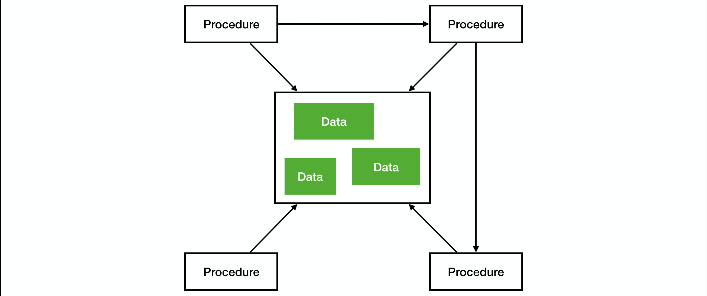
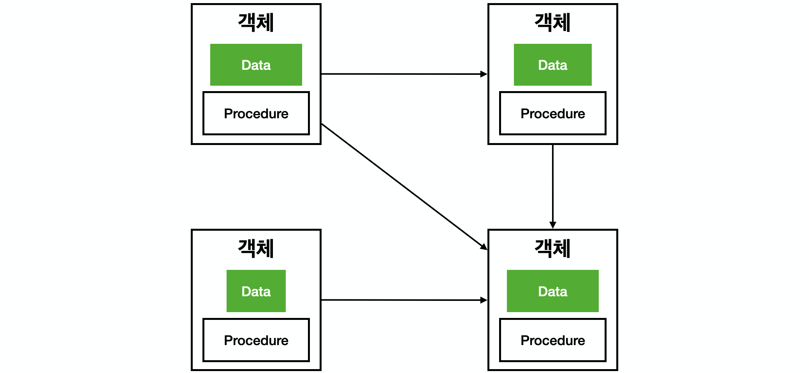
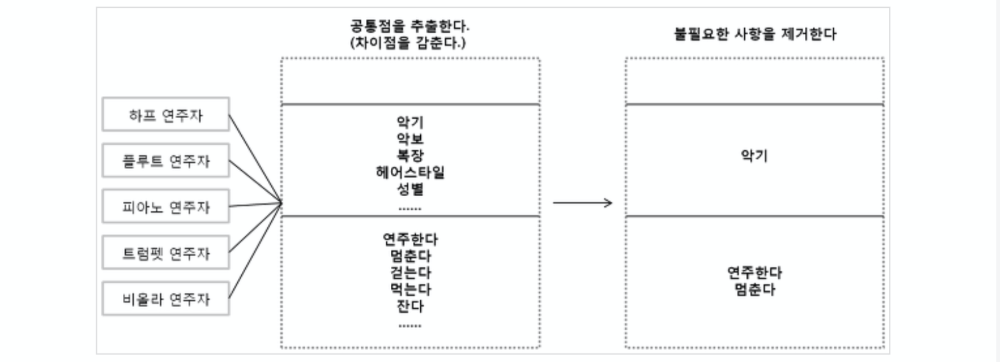

# 객체지향 프로그래밍(OOP, Object-Oriented Programming)
> 객체지향으로 프로그래밍을 한다... 개발을 접하면서 가장 많이 들어본 말이다. 하지만 여전히 이에 대해 이해하고 있는지 의심스럽다. 물론 서비스 회사에 취업을 준비중인 상황에서 객체지향을 깊게 경험해보지는 못했다고 생각한다. 객체지향으로 구현할 때는 객체지향 생활체조, SOLID 원칙에 대해 고민하며 적용해본다. 하지만 여전히 여러운 것은 사실이다. 그래서 지금까지 배우고 적용해왔던 과정들을 정리해보려고 한다. 확실하게 알지 못하다보니 정리하는 것도 힘들지만 지속적으로 객체지향에 대해 내 생각을 정리하다보면 언젠가는 이해하는 날이 오지 않을까 생각이 든다...
> - 틀린 부분이나 궁금한 점이 있으시면 언제든지 말씀해주시면 감사하겠습니다!
> - 마지막 업데이트 날짜: 2020-04-02

지금 누군가 나에게 객체지향 프로그래밍이 무엇인지 묻는다면, 짧게 "책임에 따라 객체를 분리하고, 이렇게 해서 생긴 여러 객체 사이의 의존성을 관리하는 프로그래밍"
이라고 말할 것 같다. 책임, 객체, 의존성이라는 단어는 밑에서 차차 살펴보고 객체지향이 중요한 이유부터 알고 가야 할 것 같다.

객체지향 프로그래밍 이전에는 절차지향 프로그래밍(Procedural-Oriented Programming)으로 주로 구현했다.(프로시저지향 프로그래밍이라고도 한다.) 

> 프로시저(Procedure)란? 간단히 로직을 처리하는 코드입니다. 예전에는 로직을 처리하고 반환값이 없는 것을 프로시저라고 하고 반환값이 있는 것을 function이라고 불렀다고 합니다. 하지만 현재는 function과 procedure를 구분하지 않고 쓰는 것 같습니다.

사실 객체지향 언어는 사실 절차지향 언어 C와 비슷한 시기에 나왔다. 하지만 그 당시 하드웨어 성능이 받쳐주지 못했고, 절차지향보다 객체지향으로 생각하는 것이 힘들다는 이유로 많이 사용되지 않았다고 한다. 절차지향은 아래와 같은 방식으로 구조화되어있다.



절차지향을 사옹했을 때를 떠올려보면, 학부시절 단순히 과제를 하거나 알고리즘 문제를 풀 때 사용했었다. 전역 변수나 데이터베이스에서 가져온 데이터를 한 곳에 모아두고 여러 함수(프로시저)에서 가져다쓰는 형식이었다. 데이터가 한 군데에 모여있다보니 로직을 수행하는 함수에서 필요한 것을 모두 가져다가 쓰고 단순히 생각한대로 `if-else`문을 쓰며 구현했었다. 이는 구현 속도는 빠르지만 나중에 유지보수하기가 힘들다. 물론 학교 과제나 알고리즘은 솔직히 확장할 일이 없어 유지보수가 힘든지 아닌지 경험해보지 못했다.

반면에 객체지향 프로그래밍의 구조는 아래와 같다.



객체지향은 위 그림과 같이 데이터와 프로시저를 하나의 **객체**로 감싼다. 객체는 **추상화**를 통해 추출하고, 이러한 객체는 **캡슐화**가 되어 있다고 말한다. 나눠진 여러 객체 사이에는 **의존** 관계가 있다.(위 그림에서는 화살표가 의존 관계를 나타내는 것이다.) 의존하는 객체 사이에서는 **메시지**를 통해 의사소통한다.

객체지향을 공부하다보면 위와 같이 추상화, 캡슐화, 의존 등 여러 용어들이 나오고, 객체를 나누고 관계를 맺어주는 것은 매우 어려운 작업이다. 이렇게 어려운 방식으로 구현하는 이유는 한 가지라고 생각한다. **변경과 확장이 쉽다.** 

> 현재 서비스를 보면 요구사항이 많기도 하고, 매우 빠르게 변경된다고 합니다. 그래서 변경과 확장이 매우 중요하다고 생각합니다. 절차지향보다는 객체지향으로 프로그래밍하는 것이 유연성이 높아 객체를 설계하는 시간은 오래 걸리겠지만 유지보수하는데는 이점이 크다고 합니다.

## 객체지향 요소
### 객체(Object)
객체는 위에서 살펴봤듯이 데이터와 프로시저를 가지고 있는 하나의 덩어리이다. 객체는 구현 레벨로 갔을 때 클래스(class)와 인스턴스(instance)의 관점으로 볼 수 있다.

#### 클래스(Class)
클래스는 객체의 **설계도, 틀**이라고 하는데 객체지향 언어마다 객체를 구현하는 방법이라고 볼 수 있다. Java, C++, C# 등 대표적인 언어들은 클래스로 객체를 만든다. 

> Javascript는 객체의 틀을 만드는 방법이 `class`라는 예약어가 아닌 `function`을 사용하는 것으로 알고 있습니다. 따라서 `function`으로 객체의 틀을 선언했다면 이는 클래스라고 부를 수 있을 것으로 생각합니다.

#### 인스턴스(Instance)
인스턴스는 클래스를 생성한 모습이다. 정확히 말하면 클래스를 실제로 메모리에 할당한 단계로 볼 수 있다. 간단히 예를 들어보자.

```java
public class Animal {
    private String name;
    private int age;

    public Animal(String name, int age) {
        this.name = name;
        this.age = age;
    }
    // ...
}

public Class Application {
    public static void main(String[] args) {
        Animal dog = new Animal("Dog", 3);   // 1)
        Animal cat = new Animal("Cat", 4);   // 2)
    }
}
```

- `1)`: `dog` 변수는 이름이 "Dog"이고, 나이가 3살인 Animal 클래스의 인스턴스이다.
- `2)`: `cat` 변수는 이름이 "Cat"이고, 나이가 4살인 Animal 클래스의 인스턴스이다.

위 예제를 통해 클래스와 인스턴스의 차이점이 확실히 나타난다. 클래스는 실제 데이터가 없는 객체의 틀이고, 인스턴스는 실제 데이터를 가지고 있는 객체이다.

> 경험상 객체와 인스턴스는 혼용을 많이 하는 것 같습니다. 위 예제에서 dog 객체라고도 하고, dog 인스턴스라고도 부르기도 했었습니다. 객체는 설계에서부터 구현까지 계속해서 쓰는 용어고, 인스턴스는 구현단계에서만 쓰는 용어라고 볼 수도 있다고 생각합니다.

### 추상화
> 추상화(Abstraction)
>
> 어떤 양상, 세부 사항, 구조를 좀 더 명확하게 이해하기 위해 특정 절차나 물체를 의도적으로 생략하거나 감춤으로써 복잡도를 극복하는 방법이다.
>
> 복잡성을 다루기 위해 추상화는 두 차원에서 이뤄진다. [Kramer 2007]
> - 첫 번째 차원은 구체적인 사물들 간의 공통점은 취하고 차이점은 버리는 일반화를 통해 단순하게 만드는 것이다.
> - 두 번째 차원은 중요한 부분을 강조하기 위해 불필요한 세부 사항을 제거함으로써 단순하게 만드는 것이다.
>
> 모든 경우에 추상화의 목적은 **복잡성을 이해하기 쉬운 수준으로 단순화**하는 것이다.
>
> 출처: 객체지향의 사실과 오해 P77

위는 추상화에 대해서 가장 이해하기 쉬운 설명이었다. 추상화하는 과정을 잘 나타내는 그림은 아래와 같다.



> [그림 출처](https://effectiveprogramming.tistory.com/entry/%EA%B0%9D%EC%B2%B4%EC%A7%80%ED%96%A5%EC%9D%98-%EC%98%AC%EB%B0%94%EB%A5%B8-%EC%9D%B4%ED%95%B4-%EC%9C%A0%EC%97%B0%EC%84%B1%EA%B3%BC-%EA%B0%9D%EC%B2%B4%EC%A7%80%ED%96%A5-4%EB%8C%80-%ED%8A%B9%EC%84%B1?category=660012)

위는 오케스트라에서 연주자들을 추상화한 모습이다. 추상화하는 흔히 객체 모델링을 한다고 말할 수 있다. 오케스트라 애플리케이션을 구현한다고 할 때, 추상화하는 과정은 다음과 같다.
1. 오케스트라에는 피아노 연주자, 하프 연주자, 트럼펫 연주자 등이 존재한다.
2. 이러한 연주자의 공통점을 추출하고 차이점을 버린다.(추상화 1 차원)
3. 추출한 공통점 중 불필요한 사항을 제거한다.(추상화 2 차원)
4. 피아노 연주자, 하프 연주자, 트럼펫 연주자 등은 **연주자**라는 **개념**이 도출된다.(연주자는 악기로 연주하고 멈출 수 있다.)
5. 도출된 개념으로 새로운 것들을 **분류**할 수 있다.

추상화를 통해 도출된 개념은 구현 레벨에서 **타입**으로 사용된다. 그리고 위와 같은 추상화는 객체지향 프로그래밍에서 **상속** 또는 **인터페이스 추상화**의 방법으로 할 수 있다.

추상화를 하는 이유는 **다형성**을 하기 위함이다. 다형성은 객체지향의 꽃이라 불릴 만큼 가장 중요하고, 코드에 유연성을 부여할 수 있는 방법이다.(다형성에 대해서는 좀 더 아래에서 설명할 예정이다.)


### 캡슐화
- 자신의 상태를 감싸는것, 내부와 외부를 분리
- 자신의 변화가 외부에 영향을 주지 않는 것이 중요!
- 캡슐화를 잘할수록 쉽게 구현을 변경할 수 있다.
캡슐화 규칙
- Tell, Don't Ask: 데이터를 물어보지 말고 실행해달라고만 하라
- 데미테르의 법칙: '.'를 하나만 쓰자. 한번의 호출만 한다. '.'이 하나라도 get()을 통해 다른 객체를 가져오거나, 여러번 get()을 호출하고 있다면 이 법칙을 어기고 있는지 확인해야 한다.
- 데미테르의 법칙을 지키지 않으면 하나의 함수에서 다른 함수의 여러 상태를 가져와서 처리하게 되는데 이는 제어권이 없는 상태에서 이를 처리하는 것이다. 그리고 여러 의존이 필요하여 테스트도 힘들게 하고 호출하는 함수가 변경되면 자신 역시 변경되어야 한다. 이는 캡슐화가 깨지는 것이다.

### 다형성
상위 클래스의 메서드를 여러 하위 클래스들이 overriding하여 여러 행동을 할 수 있도록 하는 것.

<-> overloading
메서드의 인수를 각각 다르게 정의하여 인수에 따라 여러 로직을 수행할 수 있도록 한다.
반환값은 overloading에 관여하지 않는다.(인수가 같은데 반환값이 다르다고 해서 overloading 되지는 않는다.

### 상속


## 객체지향 생활체조
규칙 1: 한 메서드에 오직 한 단계의 들여쓰기만 한다.
규칙 2: else 예약어를 쓰지 않는다.
규칙 3: 모든 원시값과 문자열을 포장한다.
규칙 4: 한 줄에 점을 하나만 찍는다.
규칙 5: 줄여쓰지 않는다(축약 금지).
규칙 6: 모든 엔티티를 작게 유지한다.
규칙 7: 2개 이상의 인스턴스 변수를 가진 클래스를 쓰지 않는다.
규칙 8: 일급 콜렉션을 쓴다.
규칙 9: 게터/세터/프로퍼티를 쓰지 않는다.

## SOLID 원칙

### 단일 책임 원칙(Single Responsibility Principle, SRP)
- 한 객체에는 하나의 책임만을 갖게 하는 것, 더나아가 메서드에서도 하나의 책임만 있어야 한다.
- 한 객체에 책임이 작을 수록 변경의 유연함을 얻는다.
- 클래스를 변경하는 이유는 단 한 개여야 한다.
- 메서드의 사용자가 서로 다르면 책임 다를 수도 있다. 각 사용자의 변경하는 이유가 다를 수 있기 때문이다.

### 개방-폐쇄 원칙(Open-Closed Principle, OCP)
- 확장에는 열려있고, 변경에는 닫혀있어야 한다.
- 인터페이스 추상화, 상속(다형성) <- overriding
- 전략 패턴, 템플릿 패턴
- DI
- Spring 프레임워크를 베스트 프렉티스로 활용하면 대부분 자동으로 지켜진다.

OCP가 깨질 때 주요 증상
- 다운 캐스팅을 한다.
- 비슷한 if-else 블록이 존재한다.

### 리스코프 치환 원칙(Liskov Substitution Principle, LSP)
- 상위 타입의 객체를 하위 타입의 객체로 치환해도 상위 타입을 사용하는 프로그램은 정상적으로 동작해야 한다.
- 생각해보면 당연하게 볼 수 있다. 하위 타입은 상위 타입을 확장하는 것이므로, 상위 타입의 로직을 가지고 있거나 자신만의 방식으로 구현하고 있으므로 동작이 가능해야 한다.
- 리스코프 치환 법칙을 지키지 않으면 OCP도 지켜지지 않는다.(OCP는 overriding을 이용하기 때문)
- LSP는 명세와 확장에 관한 원칙이다.

LSP가 깨지는 경우
- 직사각형-정사각형 문제(전혀 관련없는 두 객체가 상속관계를 가질 때)
- 하위 타입이 상위 타입에서 지정한 리턴 값의 범위에 해당되지 않는 값을 리턴할 때(리턴 값에 따라 로직을 처리할 때 문제가 발생함)
- istanceof를 사용할 때 (OCP도 같이 깨짐)
- 명시된 명세에 벗어난 구현을 했을 때(명세에 벗어난 값 리턴, 익셉션, 기능 수행 등)

### 인터페이스 분리 원칙(Interface Segregation Principle, ISP)
- 인터페이스는 그 인터페이스를 사용하는 클라이언트를 기준으로 분리해야 한다.
- 단일 책임 원칙과 연관이 깊음

ISP가 깨지는 경우
- C++에서 .h파일에 여러 책임의 .cpp를 같이 가지고 있는 경우, 하나의 변경에 다른 .cpp까지 재컴파일을 해야 한다.(java는 동적 링크라 해당하지 않음)

### 의존 역전 원칙(Dependency Inversion Principle, DIP)
- 고수준 모듈은 저수준 모듈에 의존해서는 안된다.
- 사용자 입장에서 하나의 기능을 변경하려 할 때 코드가 수정되는 것을 방지하기 위함이다.(OCP를 지키기 위한 방법)
- 변경되는 부분을 인터페이스로 추상화(LSP)하여 사용자는 이를 의존하게 하고, 콘크리트 클래스는 앞서 인터페이스로 추상화한 클래스에 의존하다. 즉 기존에 사용자(고수준 모듈)가 콘크리트 클래스(저수준 모듈)에 의존하던 것이 추상화로 인해 콘트래스 클래스가 이 인터페이스에 의존되도록 역전시켰다. 사용자는 이 인터페이스(이 역시 고수준 모듈이라 볼 수 있음)를 의존하고 있다. 따라서 기능이 변경되더라고 사용자입장에서는 코드 변경이 되지 않는다.
- DIP의 의존 관계는 런타임 의존 관계가 아닌 코드상의 의존 관계이다. 사실 객체지향이라는 것이 코드의 변경사항을 막기 위함이므로 런타임의 의존관계를 따질 필요는 없다고 생각한다.
- OCP를 지키기 위해 LSP를 통한 DIP를 준수한다.


## 객체지향으로 구현하기
- 전략 패턴
- 스프링
- 레이어드 아키텍처 + DDD
- 은닉에 대해

