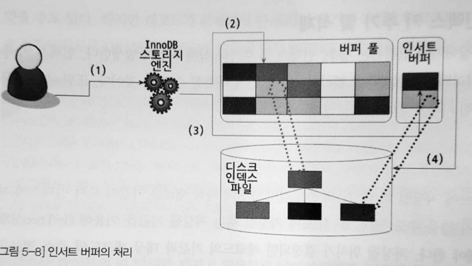
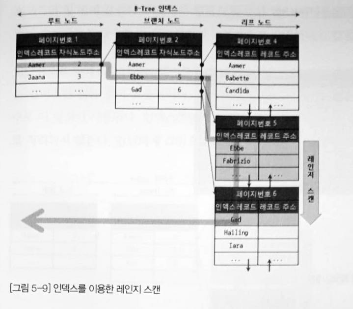
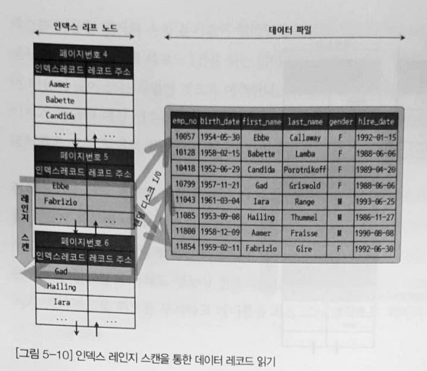

# 05 인덱스
## 5.1 디스크 읽기 방식
### 5.1.1 저장 매체
#### 내장 디스크(Internal Disk)
PC 본체 내부에 장착되는 디스크를 말합니다.
- 장점: SATA나 SAS 케이블로 연결되어 있어 속도가 빠릅니다.
- 단점: 본체 내부 공간이 제한적이므로 디스크 개수가 적고 용량이 부족합니다.

#### DAS(Direct Attached Storage)
디스크를 컴퓨터 외부에 두어 연결해서 사용하는 방식입니다.
- 장점: 여러 개의 디스크를 사용하므로 대용량이 가능하고, SATA나 SAS 방식을 사용하므로 빠릅니다.
- 단점: 한 대의 컴퓨터에만 연결가능하여 여러 컴퓨터와 공유가 불가능합니다.

#### NAS(Network Attached Storage)
네트워크 상에서 TCP/IP를 통해 디스크를 연결하는 형태입니다.
- 장점: 여러 컴퓨터와 공유가 가능합니다.
- 단점: SATA나 SAS보다 느리기 때문에 데이터베이스용 서버에서는 거의 사용하지 않습니다.

#### SAN(Storage Area Network)
- 장점: DAS로는 구축할 수 없는 큰 대용량이 가능하고, 여러 컴퓨터와 공유가 가능합니다. 또한 광케이블로 연결되어 있어 빠르고 안정적인 데이터 읽기/쓰기가 가능합니다.
- 단점: 비용이 비쌉니다.

데이터베이스용 서버로는 내장 디스크 -> DAS -> SAN 순으로 사용합니다.

### 5.1.2 SSD(Solid State Drive)
SSD는 기존의 디스크 드라이브에서 데이터 저장용 플래터인 원판을 제거하고 대신 플래시 메모리를 장착한 형태의 전자식 저장 매체입니다.
- 디스크 원판을 기계적으로 회전시킬 필요가 없어 매우 빠르게 데이터를 읽고 쓸 수 있습니다.
- 플래시 메모리를 사용하므로 전원이 공급되지 않아도 데이터가 삭제되지 않습니다.
- 기존 디스크 드라이브와 같은 인터페이스인 SATA나 SAS를 지원합니다. 그래서 내장 디스크, DAS, SAN에 그대로 사용이 가능합니다.
- 처리 속도는 CPU, D-RAM, SSD, DISK 순입니다.
- 순차 I/O는 디스크 드라이브와 비슷한 성능을 보이지만, 랜덤 I/O는 훨씬 빠른 속도를 보입니다. 데이터베이스 서버는 랜덤 I/O를 통해 작은 데이터를 읽고 쓰는 것이 대부분이므로 DBMS용 스토리지에 최적입니다.
- 일반적인 웹 서비스(OLTP) 환경의 데이터베이스는 SSD가 디스크 드라이브보다 훨씬 빠릅니다.

### 5.1.3 랜덤 I/O VS 순차 I/O
랜덤 I/O와 순차 I/O 라는 표현은 디스크 드라이브의 플래터를 돌려 읽어야 할 데이터가 저장된 위치로 디스크 헤더를 이동시킨 다음 데이터를 읽는 것을 말합니다.

데이터를 읽고 쓰는데 걸리는 시간은 디스크 헤더를 얼마나 움직이는 지에 결정됩니다. 순차 I/O는 3개의 데이터를 저장할 때 1번 디스크 헤더를 움직인다면 랜덤 I/O는 3번 디스크 헤더를 움직어야 합니다. 따라서 랜덤 I/O 작업이 훨씬 비용이 큽니다.

따라서 쿼리를 튜닝한다는 것은 일반적으로 랜덤 I/O를 줄이는 데 목적이 있습니다. 랜덤 I/O를 줄인다는 것은 꼭 필요한 데이터만 읽도록 쿼리를 개선하는 것입니다.


## 5.2 인덱스란?
인덱스를 비유적으로 표현하면 책의 제일 끝에 있는 "찾아보기"(또는 색인)으로 볼 수 있습니다. 따라서 책의 내용이 데이터 파일에 해당합니다. 책의 찾아보기를 통해 알아낼 수 있는 페이지 번호는 데이터 파일에 저장된 레코드의 주소입니다. 따라서 인덱스는 칼럼의 값과 해당 레코드가 저장된 주소를 키와 값의 쌍으로 만들어 두는 것입니다. 그리고 찾아보기에서 내용을 빨리 찾는 이유가 'ㄱ','ㄴ',...순으로 정렬되어 있다는 것인데, 인덱스 역시 칼럼의 값을 주어진 순서로 미리 정렬하여 보관합니다.

인덱스의 특징은 SortedList 자료구조와 유사합니다. SortedList는 정렬된 리스트이므로, 저장할 때는 정렬을 위해 복잡한 과정을 거칩니다. 하지만 원하는 값을 찾을 때는 빠르게 찾을 수 있습니다. 인덱스 역시 데이터를 저장하는 INSERT, UPDATE, DELETE 성능은 느리지만 데이터를 읽는 SELECT 속도를 높이는 방법입니다.

인덱스를 역할별로 구분하면 다음과 같습니다.
- **프라이머리 키(Primary Key)**: 래코드를 대표하는 칼럼 값으로 만들어진 인덱스를 말합니다. 프라이머리 키는 테이블에서 해당 레코드를 식별하는 기준이므로 식별자라고 부르며, NULL 값과 중복을 허용하지 않습니다.
- **보조 키(Secondary Key)**: 프라이머리 키를 제외한 나머지 모든 인덱스는 보조 인덱스로 분류합니다. 유니크 인덱스는 프라이머리 키를 대체하여 사용할 수 있어 대체 키라고도 하는데, 별도로 분류하기도 합니다.

인덱스를 데이터 저장 방식으로 구분하면 다음과 같습니다. 대표적인 방법들만 나열했습니다.
- **B-Tree 알고리즘**: 가장 일반적으로 사용되는 인덱스 알고리즘으로서, 오랫동안 사용한 만큼 안정적입니다. B-Tree 인덱스는 칼럼 값을 변형하지 않고, 그대로 인덱싱하는 알고리즘입니다.
- **Hash 인덱스 알고리즘**: 칼럼 값을 해시 값으로 계산하여 인덱싱하는 알고리즘으로서, 매우 빠른 검색이 가능합니다. 하지만 값을 변형하므로 전방(Prefix) 일치와 같은 값의 일부만 검색할 때는 사용할 수 없습니다. Hash 인덱스는 주로 메모리 기반의 데이터베이스에서 많이 사용합니다.
- **Fractal-Tree 알고리즘**: B-Tree 알고리즘에서 데이터가 저장되고 삭제될 때 처리 비용이 크다는 단점을 보완하기 위해 나온 알고리즘입니다. 아직 B-Tree만큼 안정적이지 않다는 단점이 있습니다.


## 5.3 B-Tree 인덱스
B-Tree의 B는 "Balanced"를 의미합니다. B-Tree는 칼럼의 원래 값을 변형시키지 않고 인덱스 구조체 내에서는 항상 정렬된 상태로 유지합니다. 대부분 인덱스는 B-Tree 알고리즘을 사용할 정도로 대중적인 알고리즘입니다. B-Tree는 여러 변형된 알고리즘이 존재하는데, DBMS에서는 일반적으로 B+-Tree 또는 B*-Tree를 사용합니다.

### 5.3.1 구조 및 특성


- **루트 노드**: 최상위 노드
- **브랜치 노드**: 중간 노드
- **리프 노드**: 가장 하위에 있는 노드, 실제 데이터 레코드의 주소 값 저장

인덱스의 키 값은 위 그림처럼 모두 정렬되어 있지만 데이터 파일의 레코드는 정렬돼 있지 않습니다. 테이블 레코드를 전혀 변경하지 않으면 INSERT 순서대로 저장되겠지만, 삭제가 일어나면 빈 공간에 그 다음 INSERT 공간으로 재활용합니다.

> InnoDB 테이블의 레코드는 클러스터되어 저장되므로 기본적으로 프라이머리 키 순서대로 정렬되어 저장됩니다.

인덱스의 리프 노드와 데이터 파일의 관계는 아래의 그림과 같습니다.


**레코드 주소**는 DBMS 종류나 스토리지 엔진에 따라 달라집니다.
- 오라클은 물리적인 레코드 주소를 사용합니다.
- MyISAM 테이블은 내부적인 레코드의 아이디를 의미합니다.
- InnoDB 테이블은 프라이머리 키값 자체가 주소 역할을 합니다.

실제 MySQL 테이블의 인덱스는 항상 인덱스 칼럼 값과 주소값의 조합이 인덱스 레코드로 구성됩니다.(위 그림에서 보이듯이)

### 5.3.2 B-Tree 인덱스 키 추가 및 검색
#### 인덱스 키 추가
추가 작업은 리프 노드가 꽉 차서 더는 저장할 수 없는 경우 분리돼야 하며, 이는 상위 브랜치 노드까지 영향을 미치므로, 비용이 많이드는 작업입니다.

대략적으로 테이블에 레코드를 추가하는 작업 비용을 **1**이라고 가정하면, 해당 테이블의 인덱스에 키를 추가하는 작업 비용은 **1~1.5**정도로 예측합니다. 예를들어 테이블에 인덱스가 3개이고 모두 B-Tree이면, 테이블에 추가하는 비용은 `1.5*3+1`로 5.5로 예측됩니다.



#### 인덱스 키 검색
인덱스 트리 탐색은 SELECT뿐 아니라 UPDATE나 DELETE를 처리하기 위해 레코드를 검색하는 경우에도 사용됩니다.

B-Tree 인덱스를 이용한 검색은 100% 일치 또는 값의 앞부분만 일치하는 경우에 사용할 수 있습니다. 부등호 비교, 값의 뒷부분 일치는 검색할 수 없고, 인덱스의 키값이 변경되면 B-Tree에 존재하지 않는 값을 검색하므로 느려집니다.

### 5.3.3 B-Tree 인덱스 사용에 영향을 미치는 요소
#### 인덱스 키값의 크기
인덱스를 구성하는 키값의 크기가 커지면 디스크로부터 읽어야 하는 횟수가 늘어나고, 그만큼 느려집니다.

#### B-Tree 깊이
인덱스 키값의 크기가 커질수록 하나의 인덱스 페이지가 담을 수 있는 인덱스 키값의 개수가 작아지고, 이는 같은 레코드 건수라도 B-Tree의 깊이가 깊어져서 디스크 읽기가 더 많이 필요하게 됩니다.

결론은 **인덱스의 키값의 크기는 가능하면 작게 만드는 것이 좋습니다.**

#### 선택도(기수성)
인덱스에서 선택도(Selectivity) 또는 기수성(Cardinality)은 거의 같은 의미로 사용되며, 모든 인덱스 키값 중 유니크한 값의 수를 의미합니다.

인덱스 키값 중 중복이 많을수록 기수성이 낮아지고 선택도가 떨어지며, 이는 검색 대상이 많다는 의미입니다. 따라서 중복이 적을수록 검색 대상이 적어져 빠르게 처리됩니다.

예를 들어, `country`라는 칼럼과 `city`라는 칼럼이 포함된 `tb_city` 테이블이 있습니다. 이 테이블의 전체 레코드 건수는 10,000개이며, `country` 칼럼으로만 인덱스가 생성된 상태입니다.(도시와 국가는 중복되지 않음)

```sql
CREATE TABLE tb_city(
    country VARCHAR(10),
    city  VARCHAR(10),
    INDEX ix_country (country)
);
```

아래 쿼리를 유니크 값 개수가 다른 두가지 케이스로 비교해보겠습니다.

```sql
SELECT * FROM WHERE country='KOREA' AND city='SEOUL';
```

`전체 레코드 건수 / 유니크한 개수`는 하나의 키로 검색했을 때 대략 몇 건의 레코드가 일치하는지 예상할 수 있습니다.

1. `country` 칼럼의 유니크 값이 10개일 때
    - `country` 유니크 값이 10개라는 것은 tb_city 테이블에는 10개 국가의 도시 정보가 저장되어 있습니다.
    - 일치하는 레코드 수는 1,000건(10,000/10)
    - 1,000건 중 `city='SEOUL'`은 1건이므로, **999건이 불필요**
2. `country` 칼럼의 유니크 값이 1,000개 일 때
    - `country` 유니크 값이 1,000개라는 것은 tb_city 테이블에는 1,000개 국가의 도시 정보가 저장되어 있습니다.
    - 일치하는 레코드 수는 1,0건(10,000/1,000)
    - 1,000건 중 `city='SEOUL'`은 1건이므로, **9건이 불필요**

#### 읽어야 하는 레코드의 건수
인덱스를 통해 테이블의 레코드를 읽는 것은 인덱스를 사용하지 않는 것보다 **높은 비용이 드는 작업입니다.**

일반적인 DBMS의 옵티마이저는 인덱스를 통해 레코드 1건을 읽는 것이 테이블에서 직접 레코드를 1건 읽는 것보다 **4~5배 정도 더 많은 비용**이 드는 것으로 예측합니다. 따라서 **전체 테이블 레코드의 20~25%를 넘어서는 건수를 읽을 때는 인덱스를 사용하지 않는 것이 더 효율적입니다.**

### 5.3.4 B-Tree 인덱스를 통한 데이터 읽기
여기서는 MySQL이 인덱스를 이용하는 대표적인 방법 3가지를 살펴보겠습니다.

#### 인덱스 레인지 스캔
인덱스 레인지 스캔은 3가지 방법 중 가장 빠르고 가장 대표적인 방법입니다. 이는 검색해야 할 인덱스의 범위가 결정됐을 때 사용하는 방식입니다. 

```sql
SELECT * FROM employees WHERE first_name BETWEEN 'Ebbe' AND 'Gad';
```



위는 인덱스 레인지 스캔을 수행하는 쿼리와 이를 그림으로 표현한 것입니다. 루트 노드부터 비교를 시작하여 브랜치 노드를 거쳐 리프 노드까지 가야만 실제로 원하는 시작 지점을 찾을 수 있습니다.



위 그림은 범위를 찾은 후 리프 노드에서 가지고 있는 실제 레코드 주소로 접근합니다. 파일을 실제 읽는 과정은 한 건 단위로 **랜덤 I/O가 발생**합니다. 위 그림을 예제로 보면 최대 3번의 랜덤 I/O가 발생하며, 이가 **인덱스를 통해 데이터 레코드를 읽을 때 비용이 많이 드는 이유**입니다.

#### 인덱스 풀 스캔
인덱스 풀 스캔은 인덱스 레인지 스캔과 달리 처음부터 끝까지 모두 읽는 방식을 말합니다. 대표적으로 쿼리의 조건절이 사용된 칼럼이 인덱스의 첫 번째 칼럼이 아닌 경우 인덱스 풀 스캔 방식을 사용합니다.

예를 들어 인덱스는 (A, B, C) 칼럼의 순서로 만들었지만, 쿼리의 조건절은 B 또는 C 칼럼으로 검색하는 경우입니다.


인덱스 풀 스캔은 위 그림과 같이 인덱스 리프 노드의 제일 앞 또는 뒤로 이도한 후 , 인덱스의 리프 노드를 연결하는 링크드 리스트를 따라서 처음부터 끝까지 스캔합니다.

일반적으로 인덱스의 크기가 테이블의 크기보다 작으므로 테이블 풀 스캔보다는 효율적이지만, 다른 인덱스 방식보다는 효율이 매우 떨어진다고 볼 수 있습니다.

#### 루스 인덱스 스캔(Loose Index Scan)
루스 인덱스 스캔은 오라클의 인덱스 스킵 스캔과 비슷하며, MySQL에서 이 기능은 아직까지 제한적으로 동작합니다. 루스 인덱스 스캔은 인덱스 레인지 스캔과 비슷하지만 중간마다 필요치 않은 인덱스 키값은 무시(SKIP)합니다.

일반적으로 `GROUP BY` 또는 집합 함수 가운데 `MAX()` 또는 `MIN()` 함수에 대해 최적화 용도로 사용합니다.

## 5.4 해시(Hash) 인덱스
해시 인덱스는 동등 비교 검색에는 최적화돼 있지만 범위를 검색한다거나 정렬된 결과를 가져오지는 못합니다. 그래서 일반적인 DBMS에서 해시 인덱스는 메모리 기반의 테이블에 주로 사용합니다.


해시 인덱스의 큰 장점은 실제 키값과 관계없이 인덱스 크기가 작고 해시의 특성상 검색이 빠르다는 것입니다. 


## 질문 리스트
- 왜 해시 인덱스는 메모리 기반 데이터베이스에서 많이 사용할까?
    - 스터디원 답변: 해시 인덱스의 장점은 위에서도 키 값의 크기와 상관없이 일정하기 때문에 인덱스 크기가 작다고 볼 수 있다. 메모리는 일반적으로 크기가 작기 때문에 해시 인덱스가 사용하기 용이하다고 생각된다.