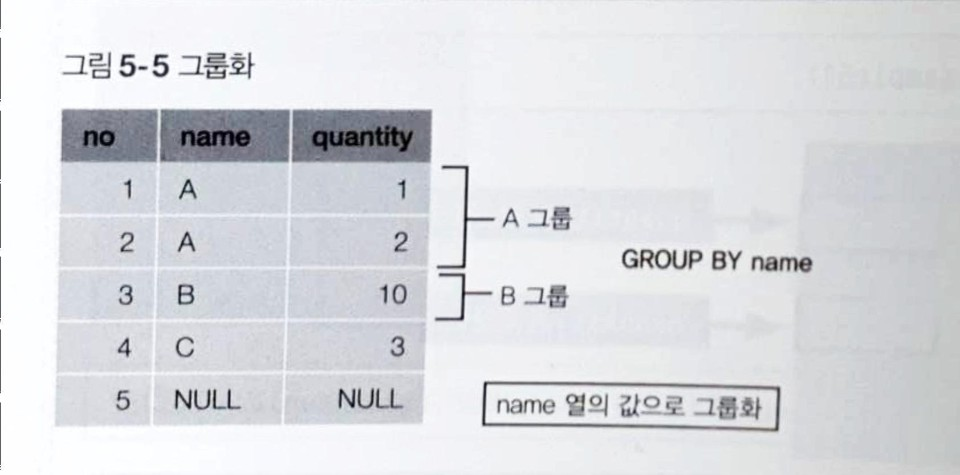
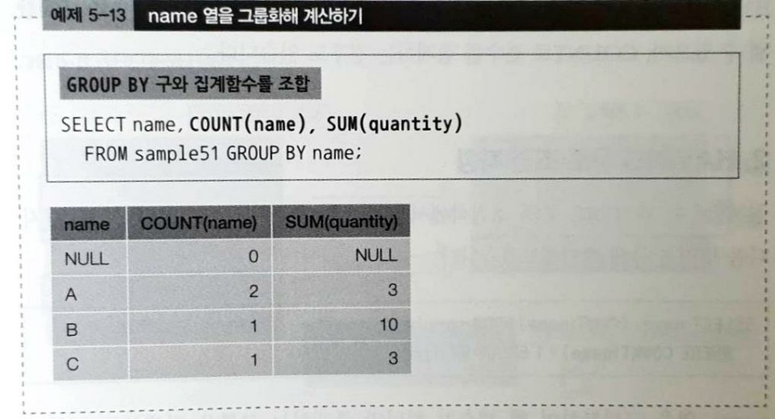
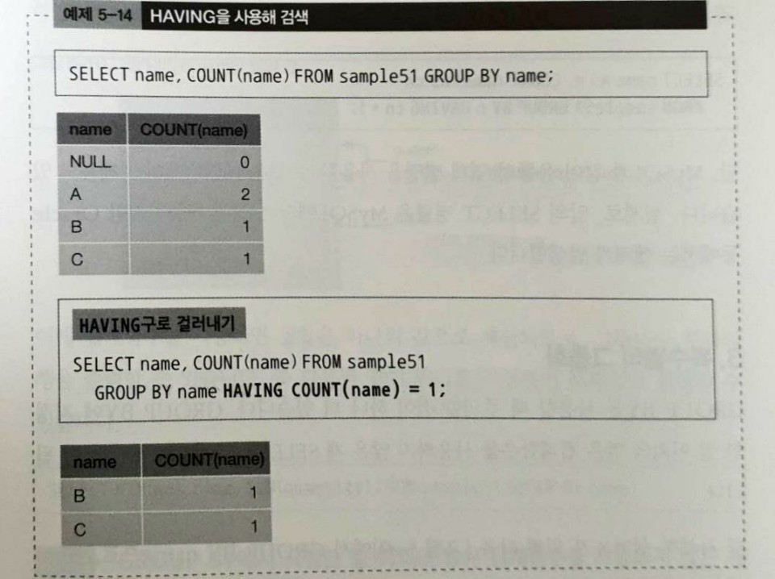
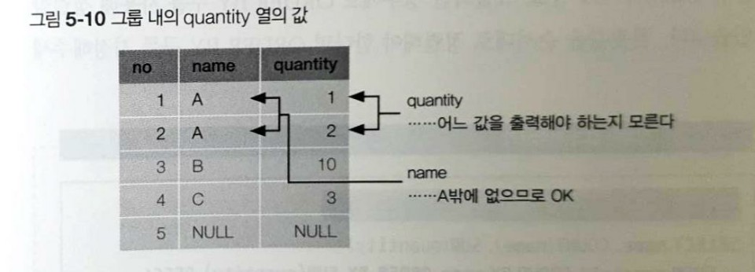
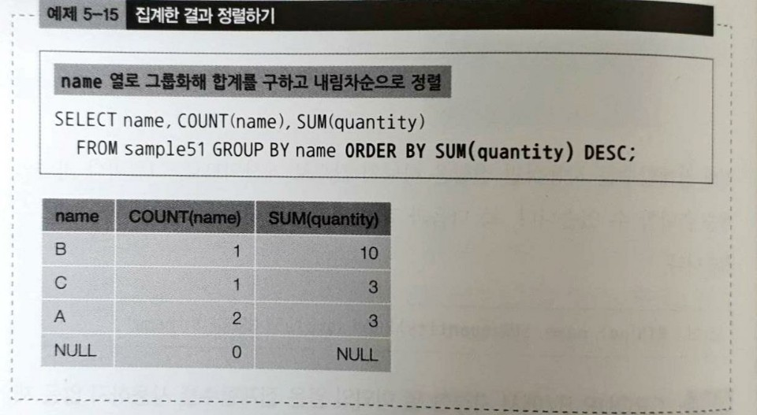

# 22강 그룹화 - GROUP BY

```sql
SELECT * FROM 테이블명 GROUP BY 열1, 열2, ...
```



- GROUP BY 구를 사용해 집계함수로 넘겨줄 집합을 그룹으로 나눌 수 있음.

## GROUP BY로 그룹화


- GROUP BY 구에 열을 지정하여 그룹화하면 **지정된 열의 값이 같은 행이 하나의 그룹으로 묶임**.
- `DISTINCT`와 같이 중복을 제거하는 효과
    - 사실 GROUP BY는 집계함수와 같이 사용하지 않으면 의미가 없음. 중복을 제거할 거면 그냥 `DISTINCT` 키워드를 사용해야 함.



- 위 예제는 GROUP BY와 함께 **집계함수**를 사용한 모습
- GROUP BY의 사용 예는 점포별, 상품별, 월별, 일별 등 **특정 단위로 집계할 때** 주로 사용

## HAVING 구로 조건 지정
- 집계함수는 WHERE 구의 조건식에서는 사용할 수 없음.
    - 이는 내부처리 순서 때문
    - WHERE -> GROUP BY -> SELECT -> ORDER BY
- 집계한 결과에서 조건에 맞는 값을 따로 걸러내는 방법은 **HAVING 구**를 사용
- HAVING 구는 GROUP BY 구의 뒤에 기술하며 WHERE 구와 동일하게 조건식을 지정
- 조건식에는 그룹별로 집계된 열의 값이나 집계함수의 계산결과가 전달된다고 생각하는게 좋음.
- 조건식이 참인 그룹값만 클라이언트에게 전달됨.



- 그룹화보다 나중에 처리되는 `ORDER BY`구는 문제없이 집계함수 사용 가능
- 내부처리 순서

```
WHERE -> GROUP BY -> HAVING -> SELECT -> ORDER BY
```

- HAVING 구는 SELECT 구보다 먼저 처리하므로 SELECT 구에서 지정한 별명을 사용할 수 없음.
    - MySQL은 별명 사용 가능

## 복수열의 그룹화
- **GROUP BY에 지정한 열 이외의 열은 집계함수를 사용하지 않은 채 SELECT 구에 기술해서는 안됨**.
- GROUP BY는 그룹당 하나의 행 반환

```sql
SELECT no, name, quantity 
FROM sample51 
GROUP BY name;
```

- 위 SQL은 데이터베이스에 따라 오류가 발생함.



- name 열 값이 A인 그룹의 quantity가 1과 2 두 개가 있으므로, 어떤 값을 선택해야 할지 모르기 때문에 에러
- 따라서 해당 열을 집계함수로 사용하면 하나로 묶이므로 문제 없이 출력됨.

```sql
SELECT MIN(no), name, SUM(quantity)
FROM sample51
GROUP BY name;
```

## 결괏값 정렬
- GROUP BY로 그룹화해도 실행결과 순서를 정렬할 수 없음.
- 데이터베이스 내부 처리에서 같은 값을 그룹으로 나누는 과정에서 순서가 바뀔 수 있음.
- 따라서 **ORDER BY 구**를 사용해서 정렬해야 함.

