# [스프링캠프 2019 [Track 2 Session 3] : 무엇을 테스트할 것인가? 어떻게 테스트할 것인가? (권용근)](https://www.youtube.com/watch?v=YdtknE_yPk4)
## 무엇을 테스트할 것인가?
### 설계 VS 구현
- 설계를 테스트하라.

### 테스트가 불가능한 부분을 걸러내라.
- 외부 API와 같이 직접 제어할 수 없는 로직은 테스트할 수 없다.
    - 항상 같은 결과가 나오는 것이 보장하지 않기 때문.

## 어떻게 테스트할 것인가?
### 테스트가 불가능한 부분이 있다면, 이 부분을 감싼 더 큰 바운더리를 만들어라.
### Spring Framework
- Spring Context가 테스트하는데 반드시 필요할지에 대해 깊이 생각해봐야 한다.
    - Spring Context는 느리다.
### Test Double
- Mockito 같은 것...
- Test Double을 사용한다는 것은 구체적인 구현을 알아야 한다는 것과 같다.
- Test Double의 남용은 구현 테스트에 가까워진다.
- Test Double을 꼭 사용해야할 자신만의 제약사항을 세워보자.
### Embedded
- 순수 자바 애플리케이션으로 테스트할 수 없는 경우
- 임베디드 시스템은 테스트 라이프사이클과 동일하게 가져가야 한다.
### EndPoint Test
- MockMvc, Rest Assured, WebTesClient
- 요청/응답 스팩에 대한 테스트라면, 컨트롤러 이외의 것은 모두 Mocking으로 대체한다.(@MockBean)
### Spring Cloud Contract

## Tip & Rule
### 테스트는 상호독릭적이여야 한다.
### 테스트의 정확한 의도를 드러내야 한다.
### 테스트코드도 리펙토링s

# [스프링캠프 2019 [Track 2 Mini-Session] : 자바에서 null을 안전히 다루는 방법 (박성철)](https://www.youtube.com/watch?v=vX3yY_36Sk4)
## 자바의 null 참조
- 의미가 모호함(가장 큰 문제)
    - 초기화되지 않음
    - 정의되지 않음
    - 값이 없음
    - null 값임
- 객체 참조의 기본 값은 null
- 모든 참조는 null이 가능

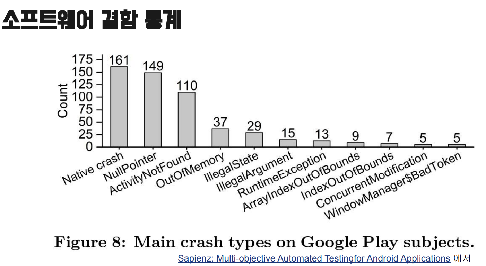

소프트웨어 결함을 조사한 결과에 따르면 Null Pointer 에러는 매우 많은 문제를 일으키고 있다.

## Part 1: null을 안전하게 다루는 방법

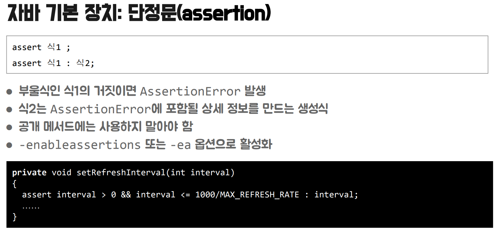

- assertion 문은 기본적으로 운영 환경에서 무시되어 쓸 수 없다.

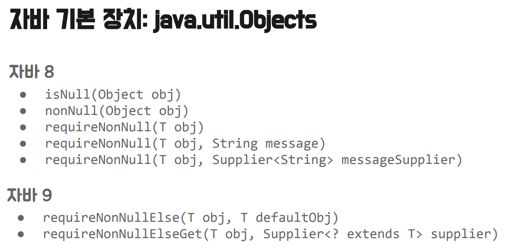

- 자바 버전이 위 이상이라면 쉽게 null을 체크할 수 있다.

- 자바의 optional은 만들다가 만 것이라는 평가가 많다.
    - serializable이 없어 필드에 사용할 수 없음
    - `.get()`과 같은 사용하면 안되는 메서드가 포함되어 있음
- https://www.youtube.com/watch?v=Ej0sss6cq14
    - 이 강의를 참고해서 보면 좋음(위 강의자료 링크)
    - 이 강의에 위 그림의 7가지 규칙을 설명해줌

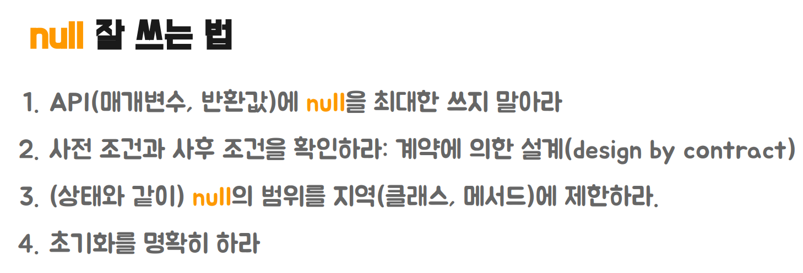

- 이 강의의 핵심
- design by contract 가 중요

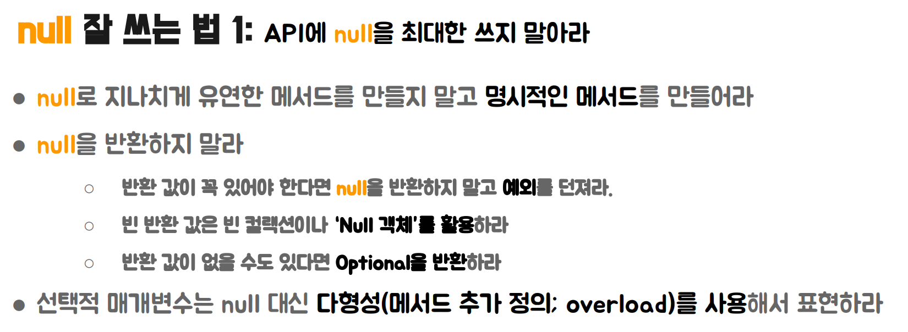

- null을 사용해야 한다면 따로 메서드를 만들어라.

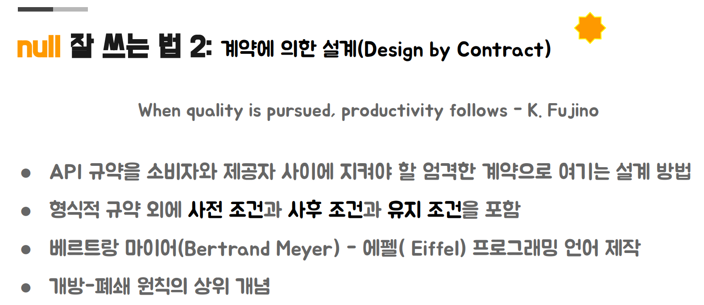

- Design by Contract를 객체지향에서 실현한 방법이 OCP이다.
    - 같은 책에서 나온 개념.

- 위는 에펠 언어의 모습
- require: 해당 메서드가 시작하기 전에 성립해야 할 조건
- .....: 로직
-  ensure: 해당 메서드가 끝나고 난 후 성립해야 할 조건
- invariant: 해당 클래스가 항상 성립해야 할 조건
- 프로그래밍은 계약을 만들고 지키면서 해야 안정적인 프로그래밍이 가능

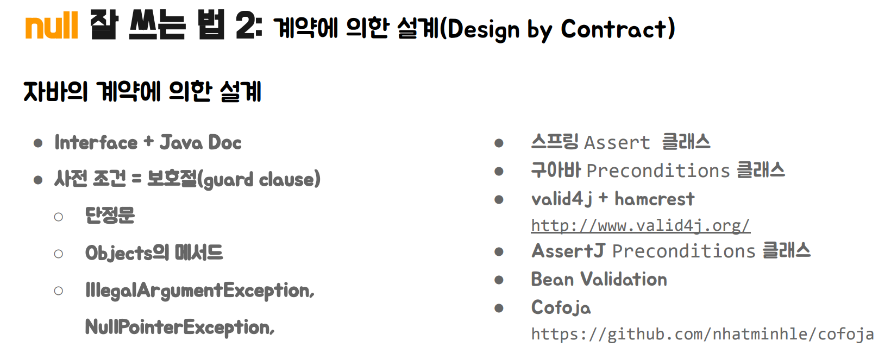

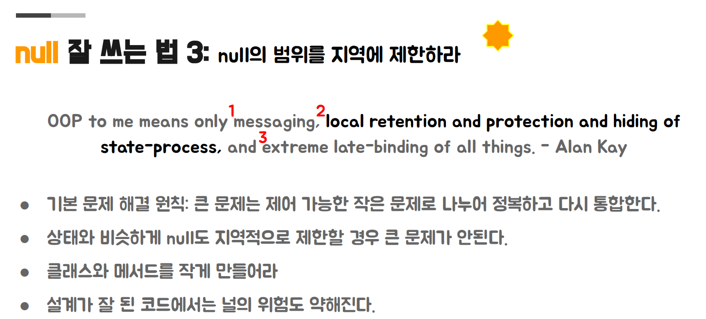

- null도 객체지향에서 상태를 외부로 전파되는 것을 막는 것과 같이 사용해야 한다.

## Part 2: null이 안전하다고 보장해주는 도구
Null 타입을 만든 Tony Hoare는 null checking은 사람이 아닌 언어가 
해주어야 한다고 말했다.

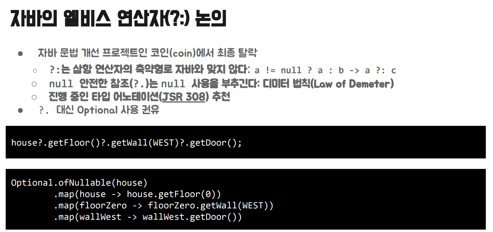

- java 역시 엘비스 연산자를 만들려고 했으나, 이를 만들면 null을 더욱 무분별하게 사용할 수 있어 추가하지 않았다.
- 엘비스 문법을 사용해야할 상황이 오면, 설계가 잘못된건 아닌지 생각해봐야 한다.
    - 엘비스 문법을 사용한다는 것은 null checking해야할 객체가 많다는 뜻이다.

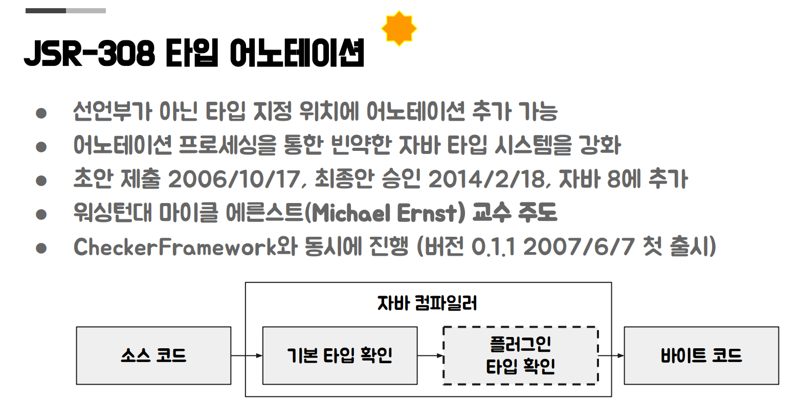

- 컴파일 시간에 타입 체크를 하며, null에 안전하지 않는 객체가 있으면 컴파일 에러를 발생시킨다.

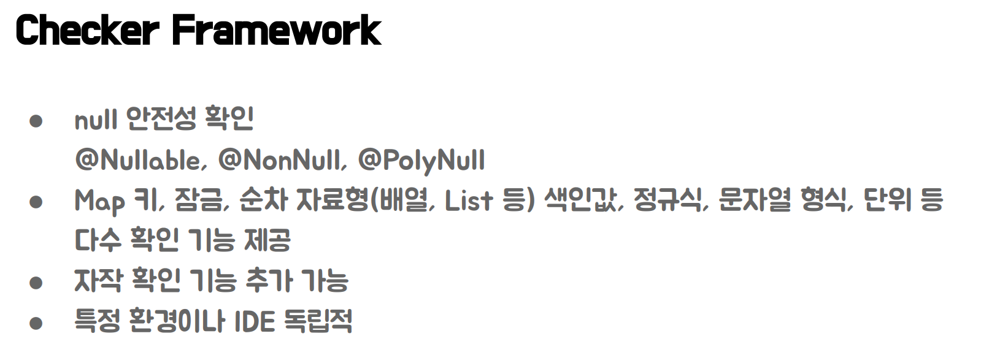

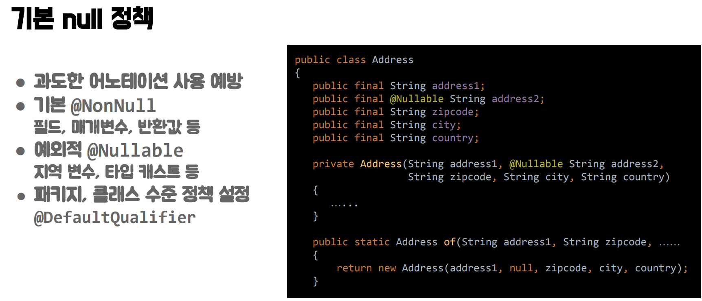

- `@NonNull`과 `@Nullable` 어노테이션은 기존에도 있었으며, Checker Framework에서는 기본적으로 `@NonNull` 어노테이션이 적용되어 있다. null 타입이 필요하다면 `@Nullable` 어노테이션을 명시적으로 선언한다.

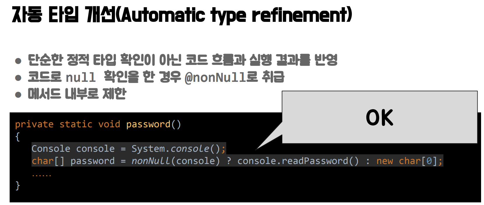

- 객체의 타입 자체가 null에 불안정하다고 해도, null 안정성을 보장해주는 코드를 추가하면 컴파일러가 이를 추적하여 null 안전하다고 판단한다.

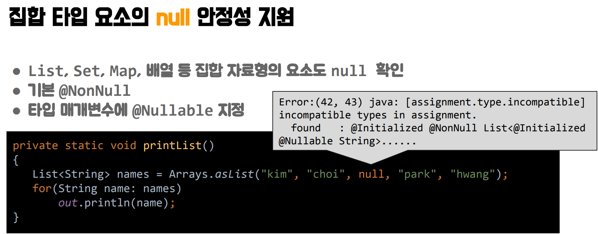

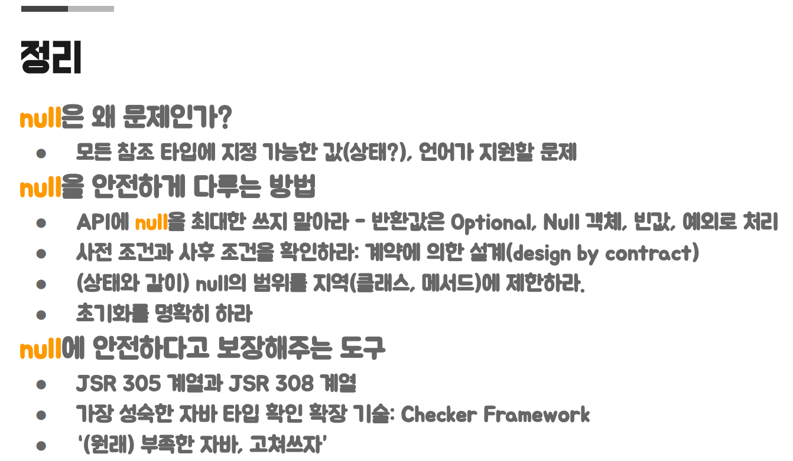

- 결론은 Checker Framework를 적극 활용하자.
    - JSR 308을 준수하여 같이 만든 프레임워크임.
    - Spring 5. 버전도 비슷한 기능이 있지만 불안정함.