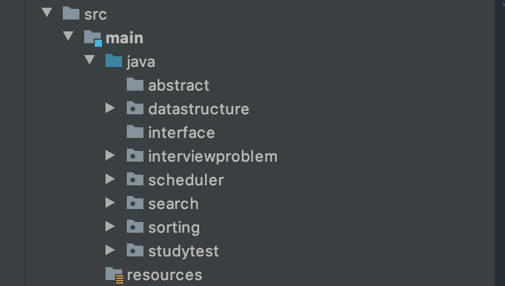

# IntelliJ 사용하면서 생긴 소소한 삽질 모음

## 패키지 이름
패키지 이름에 `abstract`, `interface`와 같은 코드에서 직접적으로 사용하는 키워드를 사용하면 패키지가 아닌 일반 디렉토리로 생성된다. 어떤 키워드가 더 있는지는 모르지만, 폴더 모양으로 구분해야 한다. 이를 몰라서 디렉토리에서 계속 java class 파일 생성이 안되서 삽질을 좀 했다...

위 그림처럼 패키지는 중간에 검은 동그라미가 있음...ㅋㅋ